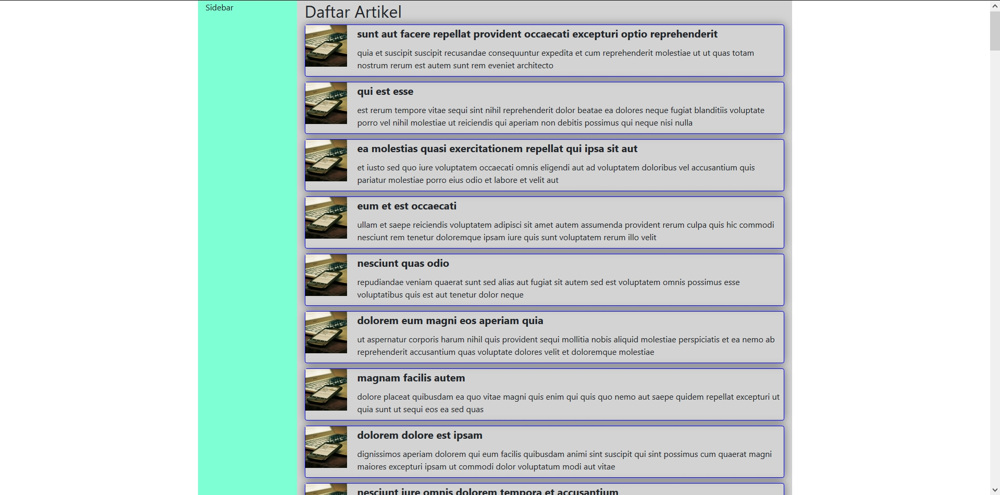
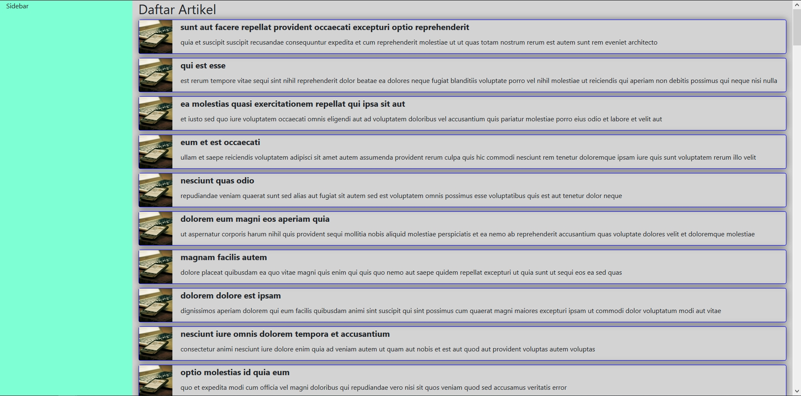
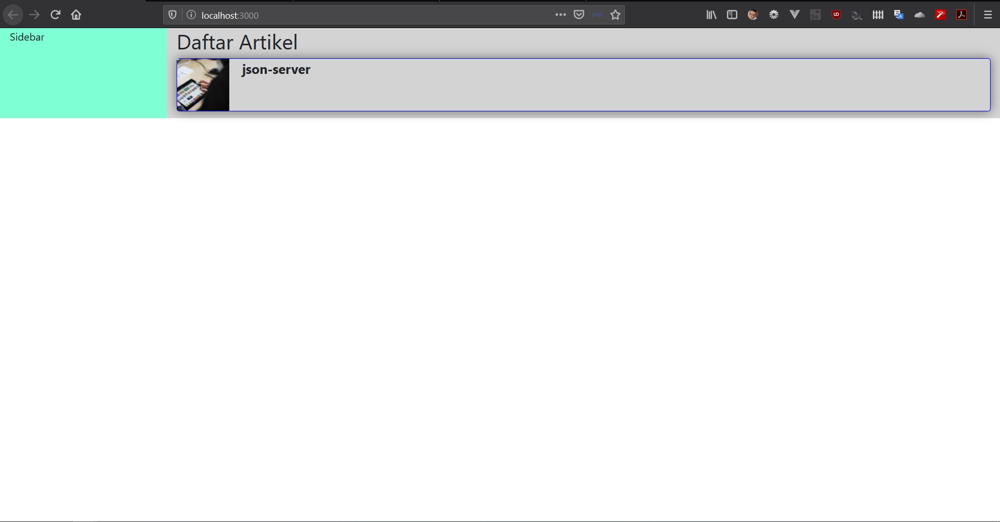
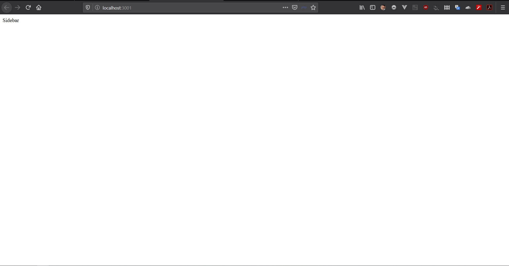
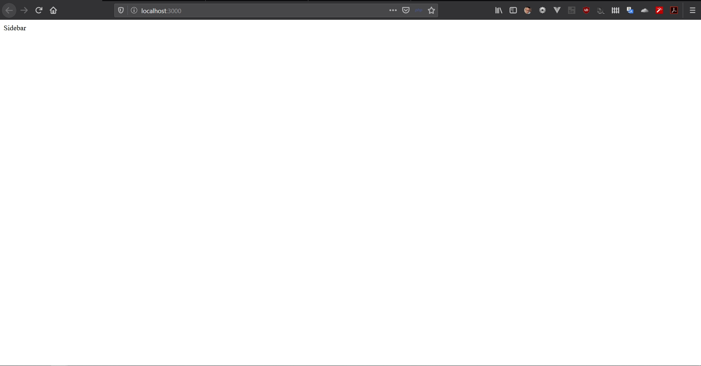
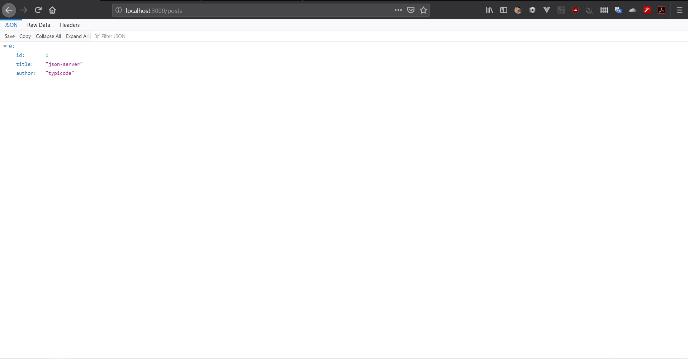
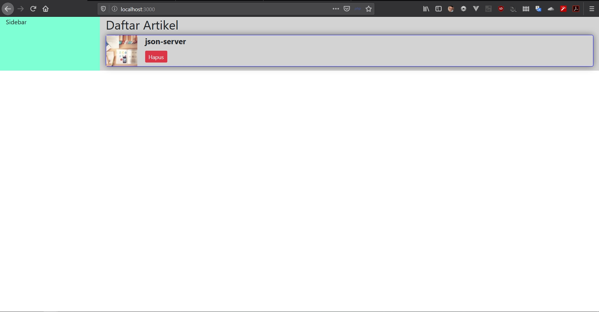
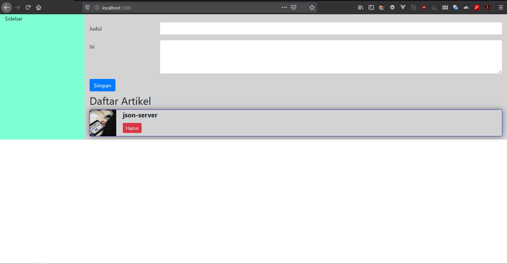
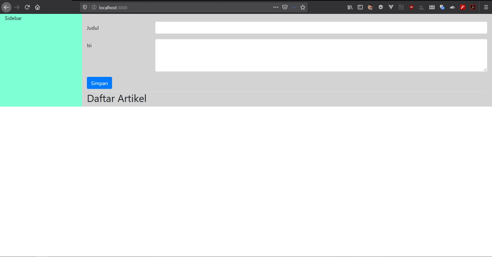

# Jawaban dari Pertemuan 5
## Jawaban Pertanyaan Praktikum 1

a. Merubah Class container ke container-fluid  atau sebaliknya pada file "public/index.html"

  1. Hasil Container dan Container-fluid
   - container
     
   - container-fluid
          

   2. Sebenarnya sama saja dalam tampilan nya namun perbedaan condong di lebar box yang ada dalam web, bila di container berfokus lebar web berada di titik tengah yang tidak full, bila di container-fluid condong lebih full dalam tampilan box nya.

b. Bila di dalam folder ReactJS sendiri memang tidak di sediakan. namun ada cara untuk menginstall nya,  dengan cara menginstall modulenya di terminal atau cmd dengan menggunakan package manager seperti `npm` 
- contoh : `npm install react-bootstrap bootstrap`
## Jawaban Pertanyaan Praktikum 2

a. Karena port 3000 sebenarnya sudah di gunakan oleh project react yang sudah terbuka, bila json-server di buka di port3000 sebenarnya bisa namun project react yang sebelumnya maka akan mengalah dan tertutup otomatis, bila json-server di buka di port 3001 maka project react bisa dibuka bersamaan dengan json-server.
   - project react
     
   - json-server
     
   - json-server posts
     
     
     
     
b. Maka project react yang sebelumnya terbuka, maka akan mengalah dan tertutup otomatis dan tergantikan oleh json-server.
   - json-server di port 3000
     
   - json-server posts di port 3000
     
     
## Jawaban Pertanyaan Praktikum 3

a. Data yang sudah dibuat atau yang sudah ada akan hilang dan terhapus dari json.

b. listArtikel.json akan berkurang dan ada yang hilang juga isinya sesuai data yang dihapus berdasarkan id.

c. Berfungsi untuk menghapus data yang dipilih dengan mengirimkan data tersebut ke dalam method DELETE pada Server di json dan di dalam json akan menghapus artikel berdasarkan "id" tersebut yang dikirimkan.

d. API yang diambil memiliki sumber data yang berbeda, yang satunya di jsonplaceholder, sedangkan satunya berada di local dengan sumber data listArtikel.json

## Jawaban Pertanyaan Praktikum 4

a. Di dalam json, saat sebelum dilakukan penambahan data, data akan tetap seperti biasanya. Namun saat selah dilakukan penambahan data, data yang di dalam json akan bertambah pada file JSON dikarenakan setelah file JSON akan di-rewrite datanya dengan data di Server.

 - Sebelum di hapus
     
 - Sesudah di hapus
     
     
b. Karena id data baru menggunakan data timestamp yang artinya semakin baru data tersebut maka waktunya akan semakin maju dan pengurutan data berdasarkan id terkecil sehingga data baru akan selalu muncul di bawah.
